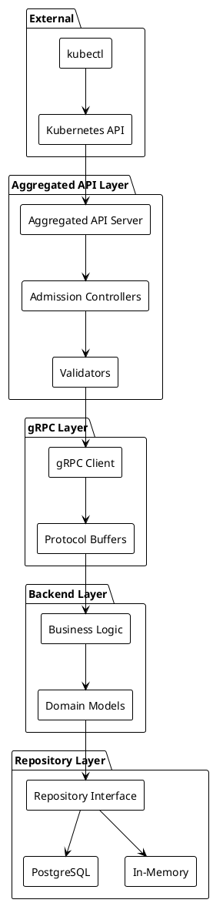

# API слои Netguard PG Backend

## Обзор API слоев

Система Netguard PG Backend использует многослойный подход к API, где каждый слой выполняет специфические функции:

1. **Kubernetes Aggregated API** - внешний интерфейс для Kubernetes
2. **gRPC API** - внутренний протокол между компонентами
3. **Repository API** - интерфейс доступа к данным

## 1. Kubernetes Aggregated API

### Назначение
Предоставляет Kubernetes-совместимый интерфейс для управления ресурсами Netguard через стандартные инструменты Kubernetes (kubectl, API clients).

### Структура API

#### API Group и версии
```yaml
apiVersion: apiregistration.k8s.io/v1
kind: APIService
metadata:
  name: v1beta1.netguard.sgroups.io
spec:
  group: netguard.sgroups.io
  version: v1beta1
  service:
    name: netguard-apiserver
    namespace: netguard-system
    port: 443
```

#### Поддерживаемые ресурсы
- `services.netguard.sgroups.io`
- `addressgroups.netguard.sgroups.io`
- `addressgroupbindings.netguard.sgroups.io`
- `addressgroupportmappings.netguard.sgroups.io`
- `rules2s.netguard.sgroups.io`
- `servicealiases.netguard.sgroups.io`
- `addressgroupbindingpolicies.netguard.sgroups.io`
- `ieagagrules.netguard.sgroups.io`

### Примеры запросов

#### Создание Service
```bash
kubectl create -f - <<EOF
apiVersion: netguard.sgroups.io/v1beta1
kind: Service
metadata:
  name: web-service
  namespace: default
spec:
  description: "Web application service"
  ingressPorts:
  - protocol: TCP
    port: "80"
    description: "HTTP port"
  - protocol: TCP
    port: "443"
    description: "HTTPS port"
EOF
```

#### Получение списка ресурсов
```bash
kubectl get services.netguard.sgroups.io -n default
kubectl get addressgroups.netguard.sgroups.io --all-namespaces
```

#### Обновление ресурса
```bash
kubectl patch service web-service -p '{"spec":{"description":"Updated description"}}'
```

### Валидация и Admission Controllers

#### Schema Validation
```go
func (s *ServiceValidator) ValidateCreate(ctx context.Context, obj runtime.Object) error {
    service := obj.(*netguardv1beta1.Service)
    
    // Проверка обязательных полей
    if service.Spec.SelfRef.Name == "" {
        return field.Required(field.NewPath("spec.selfRef.name"), "name is required")
    }
    
    // Валидация портов
    for i, port := range service.Spec.IngressPorts {
        if err := validatePort(port); err != nil {
            return field.Invalid(field.NewPath("spec.ingressPorts").Index(i), port, err.Error())
        }
    }
    
    return nil
}
```

#### Business Rule Validation
```go
func (s *ServiceValidator) ValidateUpdate(ctx context.Context, oldObj, newObj runtime.Object) error {
    oldService := oldObj.(*netguardv1beta1.Service)
    newService := newObj.(*netguardv1beta1.Service)
    
    // Проверка неизменяемых полей
    if oldService.Spec.SelfRef.Name != newService.Spec.SelfRef.Name {
        return field.Forbidden(field.NewPath("spec.selfRef.name"), "name cannot be changed")
    }
    
    return nil
}
```

## 2. gRPC API

### Назначение
Внутренний протокол для взаимодействия между Aggregated API Server и Backend Service, обеспечивающий типобезопасность и эффективность.

### Определение сервиса

```protobuf
service NetguardService {
  // CRUD операции для Service
  rpc CreateService(CreateServiceRequest) returns (CreateServiceResponse);
  rpc GetService(GetServiceRequest) returns (GetServiceResponse);
  rpc UpdateService(UpdateServiceRequest) returns (UpdateServiceResponse);
  rpc DeleteService(DeleteServiceRequest) returns (DeleteServiceResponse);
  rpc ListServices(ListServicesRequest) returns (ListServicesResponse);
  
  // CRUD операции для AddressGroup
  rpc CreateAddressGroup(CreateAddressGroupRequest) returns (CreateAddressGroupResponse);
  rpc GetAddressGroup(GetAddressGroupRequest) returns (GetAddressGroupResponse);
  rpc UpdateAddressGroup(UpdateAddressGroupRequest) returns (UpdateAddressGroupResponse);
  rpc DeleteAddressGroup(DeleteAddressGroupRequest) returns (DeleteAddressGroupResponse);
  rpc ListAddressGroups(ListAddressGroupsRequest) returns (ListAddressGroupsResponse);
  
  // Синхронизация
  rpc Sync(SyncRequest) returns (google.protobuf.Empty);
  rpc SyncStatus(google.protobuf.Empty) returns (SyncStatusResponse);
}
```

### Типы сообщений

```protobuf
message Service {
  ResourceIdentifier self_ref = 1;
  string description = 3;
  repeated IngressPort ingress_ports = 4;
  repeated AddressGroupRef address_groups = 5;
  Meta meta = 6;
}

message ResourceIdentifier {
  string name = 1;
  string namespace = 2;
}

message IngressPort {
  Networks.NetIP.Transport protocol = 1;
  string port = 2;
  string description = 3;
}

message Meta {
  string uid = 1;
  string resource_version = 2;
  int64 generation = 3;
  google.protobuf.Timestamp creation_ts = 4;
  map<string,string> labels = 5;
  map<string,string> annotations = 6;
  repeated Condition conditions = 7;
  int64 observed_generation = 8;
}
```

### Обработка ошибок

```protobuf
message Error {
  string code = 1;
  string message = 2;
  string details = 3;
  repeated string field_errors = 4;
}

enum ErrorCode {
  UNKNOWN = 0;
  VALIDATION_ERROR = 1;
  NOT_FOUND = 2;
  ALREADY_EXISTS = 3;
  CONFLICT = 4;
  INTERNAL_ERROR = 5;
}
```

## 3. Repository API

### Назначение
Абстракция доступа к данным, позволяющая использовать различные хранилища (PostgreSQL, In-Memory) без изменения бизнес-логики.

### Интерфейс Repository

```go
type Repository[T any] interface {
    // CRUD операции
    Create(ctx context.Context, entity T) (T, error)
    Get(ctx context.Context, id string) (T, error)
    Update(ctx context.Context, entity T) (T, error)
    Delete(ctx context.Context, id string) error
    List(ctx context.Context, filter Filter) ([]T, error)
    
    // Дополнительные операции
    Exists(ctx context.Context, id string) (bool, error)
    Count(ctx context.Context, filter Filter) (int64, error)
    
    // Транзакции
    WithTransaction(ctx context.Context, fn func(Repository[T]) error) error
}
```

### Специализированные интерфейсы

```go
type ServiceRepository interface {
    Repository[Service]
    FindByNamespace(ctx context.Context, namespace string) ([]Service, error)
    FindByAddressGroup(ctx context.Context, addressGroupID string) ([]Service, error)
    ValidatePortConflicts(ctx context.Context, service Service) error
}

type AddressGroupRepository interface {
    Repository[AddressGroup]
    FindByNetwork(ctx context.Context, network string) ([]AddressGroup, error)
    ValidateNetworkOverlap(ctx context.Context, addressGroup AddressGroup) error
}
```

### Реализации

#### PostgreSQL Repository
```go
type PostgreSQLServiceRepository struct {
    db *sql.DB
}

func (r *PostgreSQLServiceRepository) Create(ctx context.Context, service Service) (Service, error) {
    tx, err := r.db.BeginTx(ctx, nil)
    if err != nil {
        return Service{}, err
    }
    defer tx.Rollback()
    
    // Вставка основной записи
    query := `INSERT INTO services (name, namespace, description, meta) 
              VALUES ($1, $2, $3, $4) RETURNING id`
    var id string
    err = tx.QueryRowContext(ctx, query, 
        service.SelfRef.Name, 
        service.SelfRef.Namespace, 
        service.Description, 
        service.Meta).Scan(&id)
    if err != nil {
        return Service{}, err
    }
    
    // Вставка портов
    for _, port := range service.IngressPorts {
        _, err = tx.ExecContext(ctx, 
            `INSERT INTO service_ports (service_id, protocol, port, description) 
             VALUES ($1, $2, $3, $4)`,
            id, port.Protocol, port.Port, port.Description)
        if err != nil {
            return Service{}, err
        }
    }
    
    if err = tx.Commit(); err != nil {
        return Service{}, err
    }
    
    service.Meta.UID = id
    return service, nil
}
```

#### In-Memory Repository
```go
type InMemoryServiceRepository struct {
    services map[string]Service
    mu       sync.RWMutex
}

func (r *InMemoryServiceRepository) Create(ctx context.Context, service Service) (Service, error) {
    r.mu.Lock()
    defer r.mu.Unlock()
    
    key := fmt.Sprintf("%s/%s", service.SelfRef.Namespace, service.SelfRef.Name)
    if _, exists := r.services[key]; exists {
        return Service{}, fmt.Errorf("service already exists: %s", key)
    }
    
    service.Meta.UID = uuid.New().String()
    service.Meta.CreationTs = timestamppb.Now()
    r.services[key] = service
    
    return service, nil
}
```

## Схема взаимодействия API слоев



## Метрики и мониторинг

### Метрики по слоям

#### Kubernetes API Layer
- `netguard_api_requests_total` - общее количество запросов
- `netguard_api_request_duration_seconds` - время выполнения запросов
- `netguard_api_validation_errors_total` - количество ошибок валидации

#### gRPC Layer
- `netguard_grpc_requests_total` - количество gRPC запросов
- `netguard_grpc_request_duration_seconds` - время выполнения gRPC запросов
- `netguard_grpc_errors_total` - количество gRPC ошибок

#### Repository Layer
- `netguard_repository_operations_total` - количество операций с БД
- `netguard_repository_operation_duration_seconds` - время операций с БД
- `netguard_repository_connections_active` - активные соединения с БД

### Health Checks

```go
func (s *Service) HealthCheck(ctx context.Context) error {
    // Проверка gRPC соединения
    if err := s.grpcClient.Ping(ctx); err != nil {
        return fmt.Errorf("gRPC health check failed: %w", err)
    }
    
    // Проверка базы данных
    if err := s.repository.Ping(ctx); err != nil {
        return fmt.Errorf("database health check failed: %w", err)
    }
    
    return nil
}
``` 