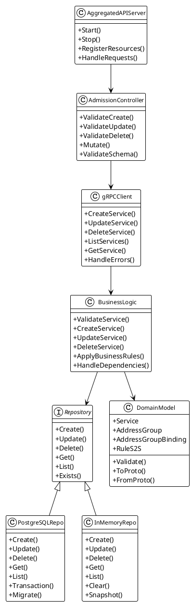

# Архитектура Netguard PG Backend

## Общая архитектура

Система построена по принципам Clean Architecture с четким разделением слоев и ответственности:

### Слои системы

#### 1. API Layer (Kubernetes Aggregated API)
- **Назначение**: Предоставляет Kubernetes-совместимый интерфейс
- **Компоненты**: 
  - API Server (k8s.io/apiserver)
  - Admission Controllers
  - Validation Webhooks
- **Протоколы**: HTTP/REST, JSON
- **Ответственность**: Валидация запросов, конвертация форматов, Kubernetes-совместимость

#### 2. Business Logic Layer (Backend)
- **Назначение**: Содержит основную бизнес-логику
- **Компоненты**:
  - Domain Models
  - Application Services
  - Validation Logic
- **Протоколы**: gRPC
- **Ответственность**: Бизнес-правила, валидация, оркестрация операций

#### 3. Repository Layer (Data Access)
- **Назначение**: Абстракция доступа к данным
- **Реализации**:
  - PostgreSQL Repository
  - In-Memory Repository
- **Интерфейсы**: Repository Pattern
- **Ответственность**: CRUD операции, транзакции, кэширование

## Детальная схема компонентов



## Потоки данных

### Создание ресурса

```plantuml
@startuml
!theme plain
skinparam backgroundColor #FFFFFF
skinparam sequenceArrowThickness 2
skinparam roundcorner 20
skinparam maxmessagesize 60

participant K as kubectl
participant K8S as K8s API Server
participant AGG as Aggregated API
participant AC as Admission Controller
participant GRPC as gRPC Client
participant BL as Business Logic
participant REPO as Repository
participant DB as Database

K->>K8S: POST /apis/netguard.sgroups.io/v1beta1/services
K8S->>AGG: Forward request
AGG->>AC: ValidateCreate(resource)

AC->>AC: Schema validation
AC->>AC: Business rule validation

alt Validation passed
    AC-->>AGG: ValidationResult{Allowed: true}
    AGG->>GRPC: CreateService(proto)
    GRPC->>BL: CreateService(domain)
    BL->>BL: Apply business rules
    BL->>REPO: Create(domain)
    REPO->>DB: INSERT transaction
    DB-->>REPO: Success
    REPO-->>BL: Created entity
    BL-->>GRPC: Success response
    GRPC-->>AGG: Success
    AGG-->>K8S: 201 Created
    K8S-->>K: Resource created
else Validation failed
    AC-->>AGG: ValidationResult{Allowed: false, Message: "..."}
    AGG-->>K8S: 400 Bad Request
    K8S-->>K: Error response
end
@enduml
```

### Чтение ресурса

```plantuml
@startuml
!theme plain
skinparam backgroundColor #FFFFFF
skinparam sequenceArrowThickness 2
skinparam roundcorner 20
skinparam maxmessagesize 60

participant K as kubectl
participant K8S as K8s API Server
participant AGG as Aggregated API
participant GRPC as gRPC Client
participant BL as Business Logic
participant REPO as Repository
participant DB as Database

K->>K8S: GET /apis/netguard.sgroups.io/v1beta1/services
K8S->>AGG: Forward request
AGG->>GRPC: ListServices()
GRPC->>BL: ListServices()
BL->>REPO: List()
REPO->>DB: SELECT query
DB-->>REPO: Data
REPO-->>BL: Domain entities
BL-->>GRPC: Proto response
GRPC-->>AGG: JSON response
AGG-->>K8S: 200 OK
K8S-->>K: Resources list
@enduml
```

## Принципы проектирования

### 1. Clean Architecture
- **Dependency Inversion**: Зависимости направлены внутрь, к домену
- **Separation of Concerns**: Каждый слой имеет четкую ответственность
- **Testability**: Каждый компонент может быть протестирован изолированно

### 2. Repository Pattern
- **Abstraction**: Скрытие деталей хранения данных
- **Flexibility**: Легкая замена реализации (PostgreSQL ↔ In-Memory)
- **Testability**: Mock репозитории для тестирования

### 3. gRPC Contract
- **Type Safety**: Строгая типизация сообщений
- **Performance**: Эффективная сериализация
- **Versioning**: Поддержка версионирования API

### 4. Kubernetes Integration
- **Compatibility**: Полная совместимость с Kubernetes API
- **Validation**: Валидация на уровне Admission Controllers
- **RBAC**: Интеграция с системой ролей Kubernetes

## Конфигурация и развертывание

### Конфигурация слоев

#### Aggregated API Server
```yaml
apiVersion: v1
kind: ConfigMap
metadata:
  name: netguard-apiserver-config
data:
  grpc-address: "netguard-backend:9090"
  validation-enabled: "true"
  admission-webhook-url: "https://netguard-webhook:8443/validate"
```

#### Backend Service
```yaml
apiVersion: v1
kind: ConfigMap
metadata:
  name: netguard-backend-config
data:
  database:
    type: "postgresql"  # или "memory"
    uri: "postgres://user:pass@db:5432/netguard"
  grpc:
    port: "9090"
    max-concurrent-streams: "100"
  validation:
    strict-mode: "true"
```

### Мониторинг и метрики

#### Метрики по слоям
- **API Layer**: Количество запросов, время ответа, ошибки валидации
- **Business Logic**: Время выполнения операций, количество транзакций
- **Repository**: Время запросов к БД, количество соединений, ошибки

#### Health Checks
- **Aggregated API**: Проверка доступности gRPC сервиса
- **Backend**: Проверка подключения к базе данных
- **Repository**: Проверка состояния транзакций

## Безопасность

### Аутентификация и авторизация
- **Kubernetes RBAC**: Интеграция с системой ролей Kubernetes
- **Service Accounts**: Использование Service Accounts для межсервисного взаимодействия
- **TLS**: Шифрование всех gRPC соединений

### Валидация данных
- **Schema Validation**: Проверка структуры данных на уровне Admission Controllers
- **Business Validation**: Проверка бизнес-правил на уровне Backend
- **Input Sanitization**: Очистка входных данных от потенциально опасного контента

## Масштабирование

### Горизонтальное масштабирование
- **Stateless Design**: Backend сервис не хранит состояние
- **Load Balancing**: Распределение нагрузки между экземплярами
- **Database Sharding**: Возможность шардинга базы данных

### Вертикальное масштабирование
- **Resource Limits**: Ограничения ресурсов для каждого слоя
- **Connection Pooling**: Пул соединений к базе данных
- **Caching**: Кэширование часто запрашиваемых данных 