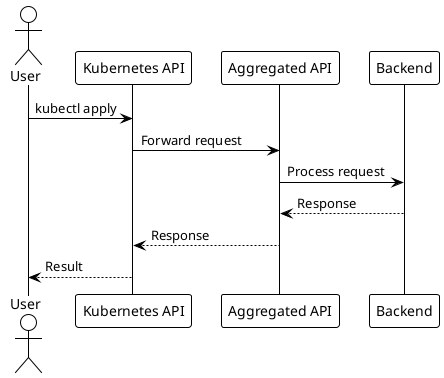

# Документация Netguard PG Backend

## Обзор

Эта документация описывает архитектуру, конфигурацию и использование системы Netguard PG Backend - многослойной системы управления сетевыми ресурсами безопасности.

## Структура документации

```
docs/
├── README.md                    # Этот файл
├── index.md                     # Основной обзор системы
├── ARCHITECTURE.md              # Детальная архитектура
├── API_LAYERS.md                # Описание API слоев
├── GRPC_CONTRACT.md             # gRPC контракт и протоколы
└── scenarios/                   # Сценарии использования
    ├── scenario_1.md            # Создание ресурсов
    ├── scenario_2.md            # Валидация
    ├── scenario_3.md            # Синхронизация
    ├── scenario_4.md            # Обработка ошибок
    ├── scenario_5.md            # Мониторинг
    ├── scenario_6.md            # Обновление ресурсов
    └── scenario_7.md            # Удаление ресурсов
```

Быстрый старт

Быстрый старт

### 1. Основные концепции

Система состоит из четырех основных слоев:

- **Kubernetes Aggregated API Server** - предоставляет Kubernetes-совместимый интерфейс
- **Backend Service** - содержит бизнес-логику и управление данными
- **gRPC Contract** - протокол взаимодействия между слоями
- **Repository Layer** - слой доступа к данным (PostgreSQL/In-Memory)

### 2. Основные ресурсы

- `Service` - сервисы с портами и протоколами
- `AddressGroup` - группы адресов
- `AddressGroupBinding` - привязки сервисов к группам адресов
- `RuleS2S` - правила взаимодействия между сервисами
- `ServiceAlias` - алиасы сервисов
- `AddressGroupBindingPolicy` - политики привязок
- `IEAgAgRule` - правила для внешних групп адресов

### 3. Примеры использования

#### Создание сервиса

```yaml
apiVersion: netguard.sgroups.io/v1beta1
kind: Service
metadata:
  name: web-service
  namespace: default
spec:
  description: "Web application service"
  ingressPorts:
  - protocol: TCP
    port: "80"
    description: "HTTP port"
  - protocol: TCP
    port: "443"
    description: "HTTPS port"
```

```bash
kubectl apply -f web-service.yaml
```

#### Создание группы адресов

```yaml
apiVersion: netguard.sgroups.io/v1beta1
kind: AddressGroup
metadata:
  name: web-clients
  namespace: default
spec:
  description: "Web clients address group"
  networks:
  - cidr: "10.0.0.0/24"
    description: "Internal network"
  action: ACCEPT
```

#### Привязка сервиса к группе адресов

```yaml
apiVersion: netguard.sgroups.io/v1beta1
kind: AddressGroupBinding
metadata:
  name: web-binding
  namespace: default
spec:
  serviceRef:
    identifier:
      name: web-service
      namespace: default
  addressGroupRef:
    identifier:
      name: web-clients
      namespace: default
```

## Конфигурация

### Базовая конфигурация

```yaml
apiVersion: v1
kind: ConfigMap
metadata:
  name: netguard-system-config
  namespace: netguard-system
data:
  apiserver:
    grpc_address: "netguard-backend:9090"
    validation_enabled: "true"
  
  backend:
    database:
      type: "postgresql"
      uri: "postgres://user:pass@db:5432/netguard"
    grpc:
      port: "9090"
```

### Конфигурация для разработки

```yaml
apiVersion: v1
kind: ConfigMap
metadata:
  name: netguard-dev-config
  namespace: netguard-dev
data:
  environment: "development"
  database:
    type: "memory"  # Используем in-memory для разработки
  logging:
    level: "debug"
```

## Мониторинг

### Prometheus конфигурация

```yaml
apiVersion: v1
kind: ConfigMap
metadata:
  name: prometheus-netguard-config
  namespace: monitoring
data:
  prometheus.yml: |
    scrape_configs:
      - job_name: 'netguard-aggregated-api'
        static_configs:
          - targets: ['netguard-apiserver:8080']
      - job_name: 'netguard-backend'
        static_configs:
          - targets: ['netguard-backend:9090']
```

### Основные метрики

- `netguard_api_requests_total` - количество API запросов
- `netguard_api_request_duration_seconds` - время выполнения запросов
- `netguard_errors_total` - количество ошибок
- `netguard_database_connections_active` - активные соединения с БД

## Сценарии использования

### 1. Создание ресурса

См. [Сценарий 1](scenarios/scenario_1.md) для детального описания процесса создания ресурсов.

### 2. Валидация

См. [Сценарий 2](scenarios/scenario_2.md) для понимания многоуровневой валидации.

### 3. Синхронизация

См. [Сценарий 3](scenarios/scenario_3.md) для работы с пакетными операциями.

### 4. Обработка ошибок

См. [Сценарий 4](scenarios/scenario_4.md) для понимания обработки ошибок.

### 5. Мониторинг

См. [Сценарий 5](scenarios/scenario_5.md) для настройки мониторинга.

### 6. Обновление ресурсов

См. [Сценарий 6](scenarios/scenario_6.md) для безопасного обновления.

### 7. Удаление ресурсов

См. [Сценарий 7](scenarios/scenario_7.md) для безопасного удаления.

## Диаграммы

Все диаграммы в документации используют PlantUML синтаксис и могут быть просмотрены:

1. **В Markdown редакторах** с поддержкой PlantUML (VS Code с расширением)
2. **Через PlantUML сервер** - скопируйте код диаграммы и вставьте на http://www.plantuml.com/plantuml/
3. **Локально** с установленным PlantUML

### Пример диаграммы



## Устранение неполадок

### Частые проблемы

1. **Ошибка валидации**

   - Проверьте схему ресурса
   - Убедитесь в корректности бизнес-правил
2. **Ошибка зависимостей**

   - Проверьте существование связанных ресурсов
   - Убедитесь в корректности ссылок
3. **Ошибка подключения к БД**

   - Проверьте настройки подключения
   - Убедитесь в доступности базы данных

### Логи

```bash
# Логи Aggregated API Server
kubectl logs -n netguard-system deployment/netguard-apiserver

# Логи Backend Service
kubectl logs -n netguard-system deployment/netguard-backend

# Логи с фильтрацией
kubectl logs -n netguard-system deployment/netguard-backend | grep ERROR
```

### Health Checks

```bash
# Проверка здоровья API Server
kubectl get endpoints -n netguard-system netguard-apiserver

# Проверка здоровья Backend
kubectl get endpoints -n netguard-system netguard-backend

# Проверка метрик
curl http://netguard-backend:9090/metrics
```

## Разработка

### Добавление новых ресурсов

1. Определите схему ресурса в `api/` директории
2. Добавьте валидацию в Admission Controllers
3. Реализуйте бизнес-логику в Backend
4. Добавьте поддержку в Repository
5. Обновите документацию

### Тестирование

```bash
# Запуск тестов
go test ./...

# Запуск интеграционных тестов
go test ./test/integration/...

# Запуск с покрытием
go test -cover ./...
```

## Поддержка

- **Документация**: Этот репозиторий
- **Issues**: GitHub Issues
- **Discussions**: GitHub Discussions

## Лицензия

См. файл LICENSE в корне проекта.
