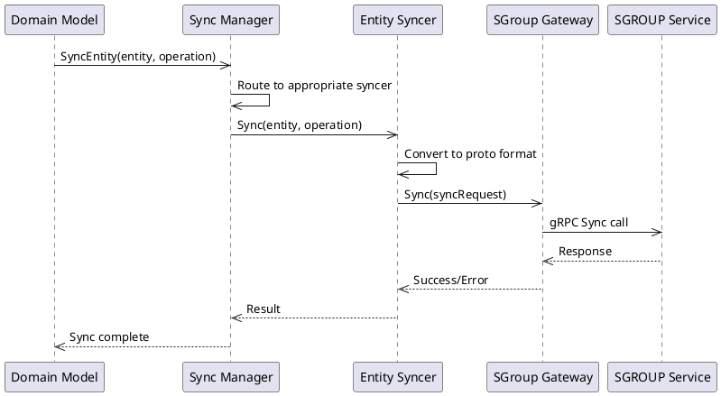
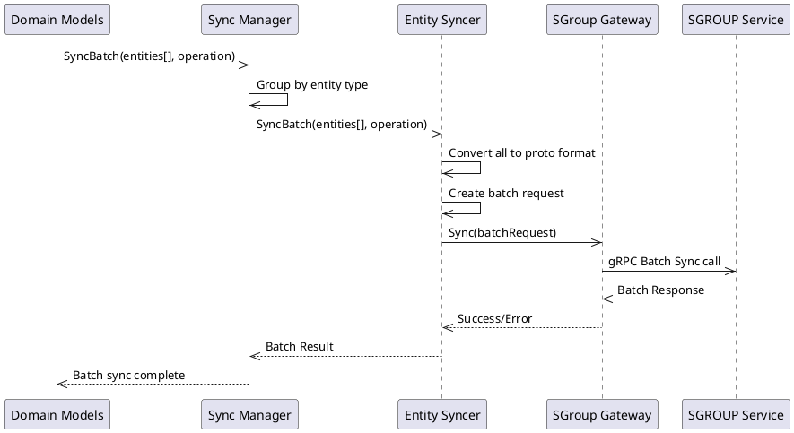

# Синхронизация с SGROUP

## Обзор

Система синхронизации обеспечивает двустороннее взаимодействие между Netguard PG Backend и внешним сервисом SGROUP через gRPC протокол. Синхронизация позволяет поддерживать консистентность данных между системами и обеспечивает автоматическое распространение изменений.

## Архитектура синхронизации

### Основные компоненты

#### 1. SGroup Gateway (`internal/sync/clients/sgroups_client.go`)
- **Назначение**: gRPC клиент для взаимодействия с внешним сервисом SGROUP
- **Функции**:
  - Установка защищенного TLS соединения
  - Отправка запросов синхронизации
  - Обработка ответов и ошибок
  - Health check проверки

#### 2. Sync Manager (`internal/sync/manager/sync_manager.go`)
- **Назначение**: Центральный менеджер синхронизации с поддержкой регистрации синхронизаторов
- **Функции**:
  - Регистрация специализированных синхронизаторов
  - Маршрутизация запросов к соответствующим синхронизаторам
  - Управление жизненным циклом синхронизации
  - Debouncing и throttling запросов

#### 3. Entity Syncers (`internal/sync/syncers/`)
Специализированные синхронизаторы для каждого типа сущности:

- **AddressGroupSyncer** - синхронизация групп адресов
- **NetworkSyncer** - синхронизация сетей
- **IEAgAgRuleSyncer** - синхронизация IEAGAG правил

#### 4. Sync Tracker
- **Назначение**: Отслеживание статистики синхронизации и реализация debouncing
- **Функции**:
  - Сбор метрик синхронизации
  - Предотвращение избыточных запросов
  - Мониторинг производительности

## Поддерживаемые типы сущностей

### 1. AddressGroup → SGROUP Groups
```go
// Интерфейс синхронизации
type SyncableEntity interface {
    GetSyncSubjectType() types.SyncSubjectType
    ToSGroupsProto() (interface{}, error)
    GetSyncKey() string
}

// Реализация для AddressGroup
func (ag *AddressGroup) GetSyncSubjectType() types.SyncSubjectType {
    return types.SyncSubjectTypeGroups
}
```

**Маппинг данных**:
- `Name` → SGROUP Group Name
- `Addresses` → SGROUP Group Members
- `Namespace` → добавляется к имени группы

### 2. Network → SGROUP Networks
```go
func (n *Network) GetSyncSubjectType() types.SyncSubjectType {
    return types.SyncSubjectTypeNetworks
}
```

**Маппинг данных**:
- `Name` → SGROUP Network Name
- `CIDR` → SGROUP Network CIDR
- `Namespace` → добавляется к имени сети

### 3. IEAgAgRule → SGROUP IEAgAgRules
```go
func (rule *IEAgAgRule) GetSyncSubjectType() types.SyncSubjectType {
    return types.SyncSubjectTypeIEAgAgRules
}
```

**Маппинг данных**:
- `From/To Groups` → SGROUP Rule Groups
- `Ports` → SGROUP Rule Ports
- `Transport` → SGROUP Rule Transport Protocol

## Типы операций синхронизации

### 1. FullSync
```go
const SyncOperationFullSync SyncOperation = "FullSync"
```
- **Описание**: Полная синхронизация (delete + insert + update)
- **Использование**: Первоначальная синхронизация или восстановление после сбоев
- **Особенности**: Удаляет все существующие данные и создает новые

### 2. Upsert
```go
const SyncOperationUpsert SyncOperation = "Upsert"
```
- **Описание**: Создание новых записей и обновление существующих
- **Использование**: Стандартные операции создания и изменения
- **Особенности**: Не удаляет существующие данные

### 3. Delete
```go
const SyncOperationDelete SyncOperation = "Delete"
```
- **Описание**: Удаление записей
- **Использование**: При удалении сущностей из системы
- **Особенности**: Только операции удаления

### 4. NoOp
```go
const SyncOperationNoOp SyncOperation = "NoOp"
```
- **Описание**: Без операции
- **Использование**: Когда синхронизация не требуется
- **Особенности**: Пропускает синхронизацию

## Процесс синхронизации

### Одиночная синхронизация



### Batch синхронизация



## Конфигурация

### Настройки подключения к SGROUP

```yaml
sgroup:
  # Адрес SGROUP сервиса
  endpoint: "sgroup-service:9090"
  
  # Настройки TLS
  tls:
    enabled: true
    cert_file: "/certs/client.crt"
    key_file: "/certs/client.key"
    ca_file: "/certs/ca.crt"
    server_name: "sgroup-service"
  
  # Настройки соединения
  connection:
    timeout: "30s"
    keepalive_time: "30s"
    keepalive_timeout: "5s"
    keepalive_permit_without_stream: true
  
  # Настройки retry
  retry:
    max_retries: 3
    initial_delay: 100  # milliseconds
    max_delay: 5000     # milliseconds
    backoff_factor: 2.0
```

### Настройки синхронизации

```yaml
sync:
  # Включение/отключение синхронизации
  enabled: true
  
  # Настройки debouncing
  debouncing:
    enabled: true
    window: "1s"  # окно debouncing
  
  # Настройки batch операций
  batch:
    enabled: true
    max_size: 100
    timeout: "5s"
  
  # Мониторинг
  metrics:
    enabled: true
    port: 8080
    path: "/metrics"
```

## Обработка ошибок

### Типы ошибок

1. **Сетевые ошибки**
   - Таймауты соединения
   - Недоступность SGROUP сервиса
   - TLS ошибки

2. **Ошибки валидации**
   - Некорректный формат данных
   - Нарушение бизнес-правил SGROUP
   - Конфликты имен

3. **Ошибки конвертации**
   - Ошибки преобразования в protobuf
   - Несовместимые типы данных
   - Отсутствующие обязательные поля

### Стратегии retry

```go
type RetryConfig struct {
    MaxRetries    int     // Максимальное количество попыток
    InitialDelay  int     // Начальная задержка (мс)
    MaxDelay      int     // Максимальная задержка (мс)
    BackoffFactor float64 // Коэффициент увеличения задержки
}
```

**Exponential Backoff**:
- 1-я попытка: 100ms
- 2-я попытка: 200ms
- 3-я попытка: 400ms
- Максимум: 5000ms

## Мониторинг и метрики

### Ключевые метрики

1. **Счетчики операций**
   - `sync_requests_total{type, operation, status}`
   - `sync_batch_requests_total{type, operation, status}`

2. **Время выполнения**
   - `sync_duration_seconds{type, operation}`
   - `sync_batch_duration_seconds{type, operation}`

3. **Ошибки**
   - `sync_errors_total{type, error_type}`
   - `sync_retry_attempts_total{type}`

4. **Состояние соединения**
   - `sgroup_connection_status`
   - `sgroup_health_check_status`

### Health Checks

```go
// Проверка доступности SGROUP сервиса
func (c *SGroupsClient) Health(ctx context.Context) error {
    _, err := c.client.HealthCheck(ctx, &emptypb.Empty{})
    return err
}
```

## Безопасность

### TLS конфигурация

```go
// Настройка TLS соединения
func (c *SGroupsClient) setupTLS(config TLSConfig) (credentials.TransportCredentials, error) {
    if !config.Enabled {
        return insecure.NewCredentials(), nil
    }
    
    cert, err := tls.LoadX509KeyPair(config.CertFile, config.KeyFile)
    if err != nil {
        return nil, fmt.Errorf("failed to load client certificates: %w", err)
    }
    
    caCert, err := os.ReadFile(config.CAFile)
    if err != nil {
        return nil, fmt.Errorf("failed to read CA certificate: %w", err)
    }
    
    caCertPool := x509.NewCertPool()
    caCertPool.AppendCertsFromPEM(caCert)
    
    tlsConfig := &tls.Config{
        Certificates: []tls.Certificate{cert},
        RootCAs:      caCertPool,
        ServerName:   config.ServerName,
    }
    
    return credentials.NewTLS(tlsConfig), nil
}
```

### Аутентификация

- **mTLS**: Взаимная аутентификация через клиентские сертификаты
- **Token-based**: Поддержка JWT токенов для аутентификации
- **Service Account**: Использование Kubernetes Service Accounts

## Производительность

### Оптимизации

1. **Connection Pooling**: Переиспользование gRPC соединений
2. **Batch Operations**: Группировка операций для снижения накладных расходов
3. **Debouncing**: Предотвращение избыточных запросов синхронизации
4. **Async Processing**: Асинхронная обработка запросов синхронизации

### Рекомендации по масштабированию

- **Горизонтальное масштабирование**: Несколько экземпляров backend сервиса
- **Load Balancing**: Распределение нагрузки между SGROUP сервисами
- **Circuit Breaker**: Защита от каскадных сбоев
- **Rate Limiting**: Ограничение частоты запросов

## Troubleshooting

### Частые проблемы

1. **Ошибки подключения**
   ```
   ERROR: failed to connect to sgroup service: connection refused
   ```
   **Решение**: Проверить доступность SGROUP сервиса и настройки сети

2. **TLS ошибки**
   ```
   ERROR: tls: certificate verify failed
   ```
   **Решение**: Проверить корректность сертификатов и CA

3. **Ошибки конвертации**
   ```
   ERROR: failed to convert entity to sgroups proto
   ```
   **Решение**: Проверить корректность данных и реализацию ToSGroupsProto()

### Диагностические команды

```bash
# Проверка статуса синхронизации
curl http://backend:8080/sync/status

# Проверка метрик
curl http://backend:8080/metrics | grep sync

# Проверка health check
curl http://backend:8080/health/sgroup
```

## Примеры использования

### Синхронизация AddressGroup

```go
// Создание AddressGroup
addressGroup := &models.AddressGroup{
    Name:      "web-servers",
    Namespace: "production",
    Addresses: []string{"10.0.1.10", "10.0.1.11", "10.0.1.12"},
}

// Синхронизация с SGROUP
err := syncManager.SyncEntity(ctx, addressGroup, types.SyncOperationUpsert)
if err != nil {
    log.Printf("Failed to sync AddressGroup: %v", err)
}
```

### Batch синхронизация Networks

```go
// Создание нескольких сетей
networks := []interfaces.SyncableEntity{
    &models.Network{Name: "web-net", CIDR: "10.0.1.0/24"},
    &models.Network{Name: "db-net", CIDR: "10.0.2.0/24"},
    &models.Network{Name: "cache-net", CIDR: "10.0.3.0/24"},
}

// Batch синхронизация
err := syncManager.SyncBatch(ctx, networks, types.SyncOperationUpsert)
if err != nil {
    log.Printf("Failed to sync Networks batch: %v", err)
}
```

## Заключение

Система синхронизации с SGROUP обеспечивает надежное и эффективное взаимодействие между Netguard PG Backend и внешним сервисом SGROUP. Архитектура построена на принципах модульности, расширяемости и отказоустойчивости, что позволяет легко добавлять новые типы сущностей и адаптироваться к изменениям в протоколе SGROUP.