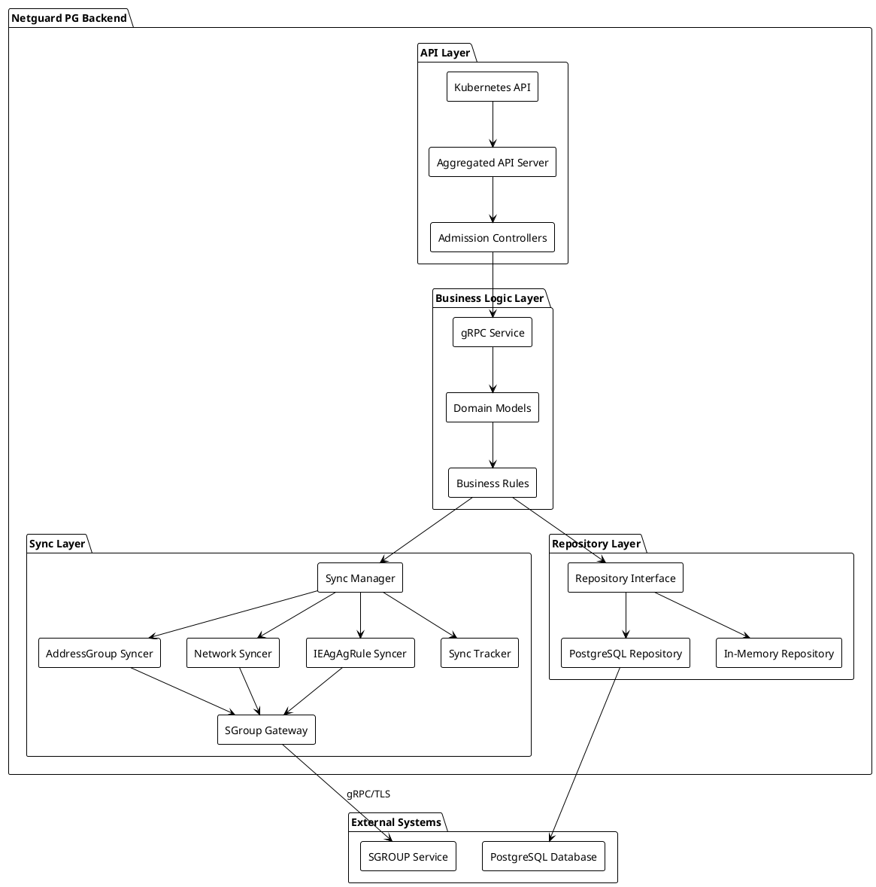
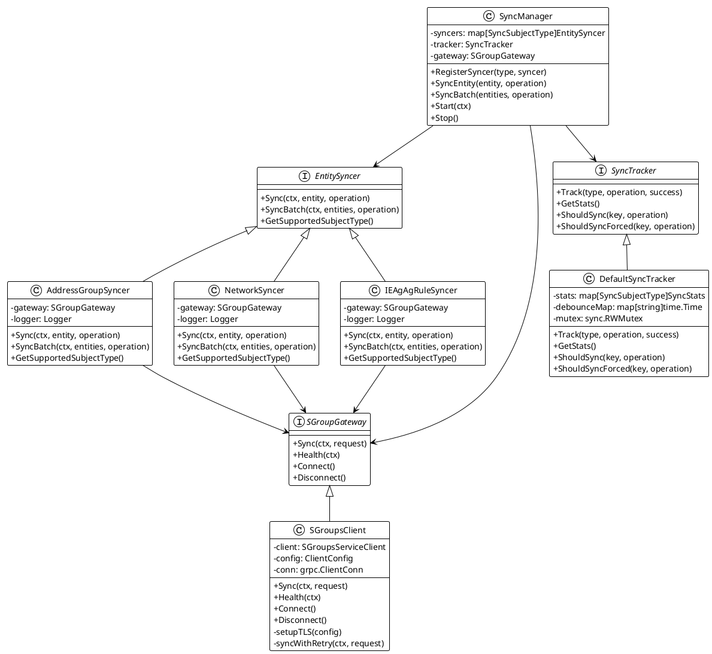
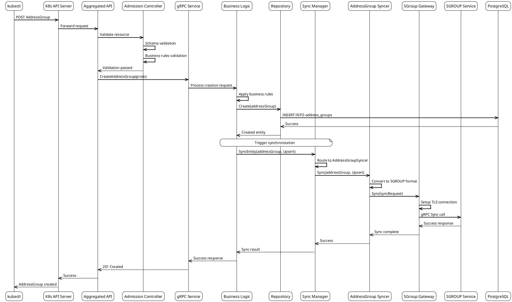
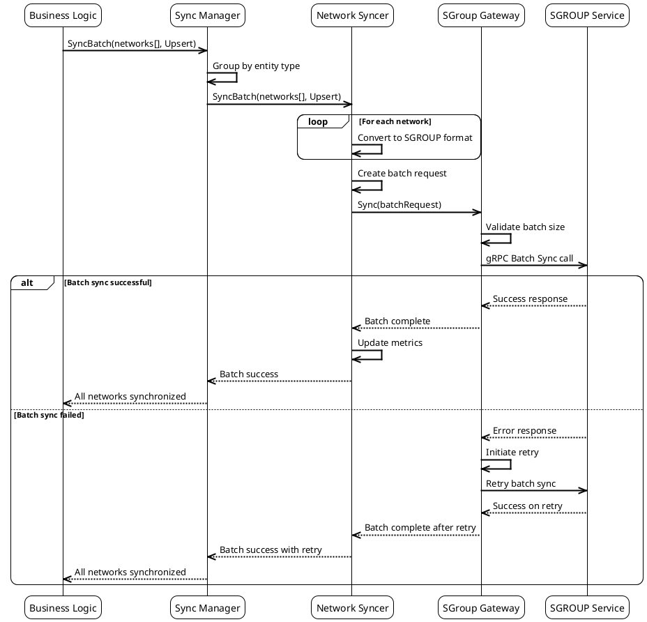
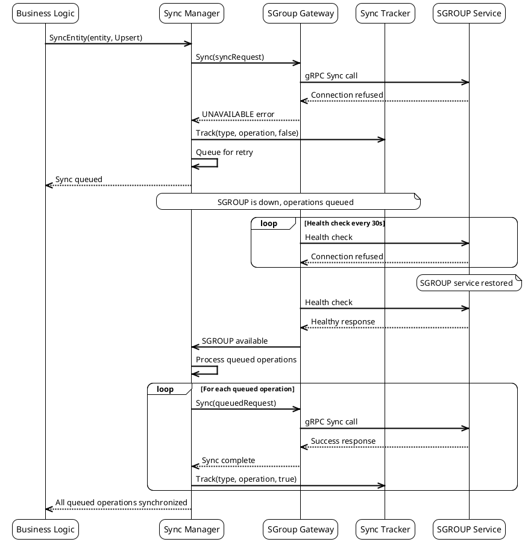
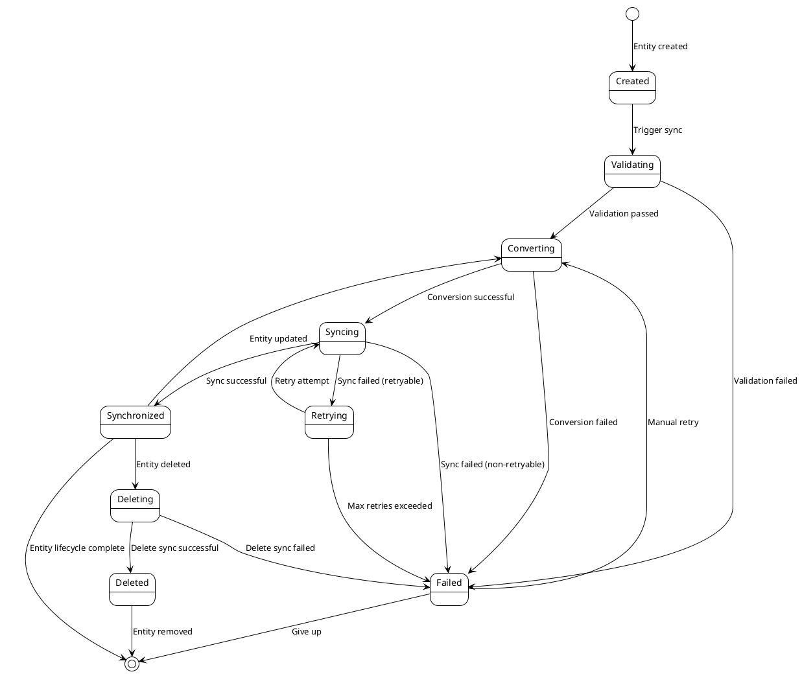
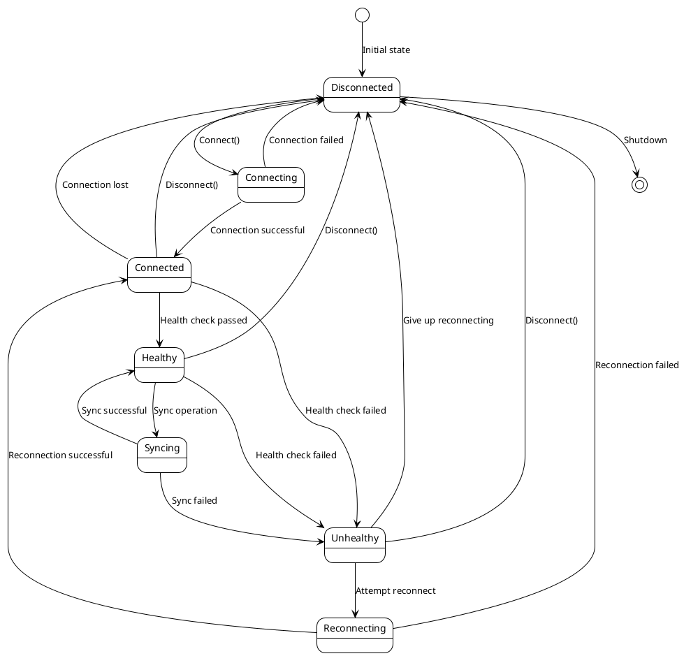
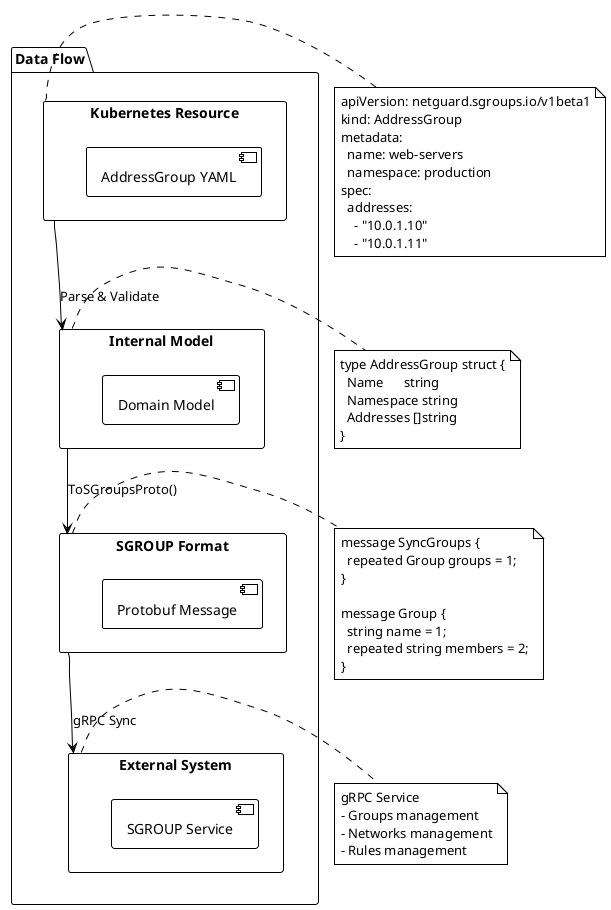

# Диаграммы синхронизации с SGROUP

## Обзор

Данный документ содержит диаграммы архитектуры и процессов синхронизации с SGROUP в формате PlantUML. Диаграммы помогают визуализировать взаимодействие компонентов, потоки данных и последовательность операций.

## Архитектурные диаграммы

### 1. Общая архитектура системы синхронизации



### 2. Компоненты слоя синхронизации



## Диаграммы последовательности

### 3. Создание AddressGroup с синхронизацией



### 4. Batch синхронизация Networks



### 5. Обработка сбоя SGROUP с восстановлением



## Диаграммы состояний

### 6. Состояния синхронизации сущности



### 7. Состояния SGROUP соединения



## ### 9. Поток данных при синхронизации



```## Заключение

Представленные диаграммы обеспечивают полное понимание архитектуры и процессов синхронизации с SGROUP:

1. **Архитектурные диаграммы** - показывают структуру компонентов и их взаимосвязи
2. **Диаграммы последовательности** - демонстрируют потоки выполнения операций
3. **Диаграммы состояний** - описывают жизненные циклы сущностей и соединений
4. **Диаграммы развертывания** - показывают физическое размещение компонентов
5. **Диаграммы мониторинга** - иллюстрируют сбор и обработку метрик

Эти диаграммы могут быть использованы для:

- Понимания архитектуры системы
- Планирования разработки
- Документирования процессов
- Обучения новых разработчиков
- Диагностики проблем
