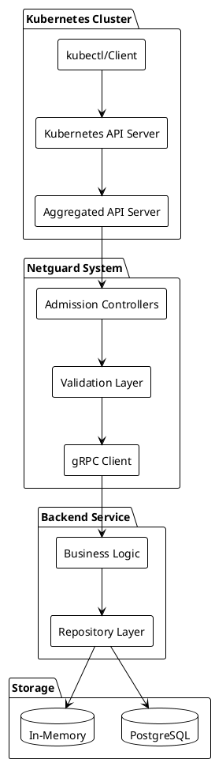

# Система Netguard Backend

## Введение

Netguard Backend - это многослойная система управления сетевыми ресурсами безопасности, состоящая из:

1. **Kubernetes Aggregated API Server** - обеспечивает Kubernetes-совместимый доступ к ресурсам
2. **Backend Service** - содержит бизнес-логику и управление данными
3. **gRPC Contract** - протокол взаимодействия между слоями
4. **Repository Layer** - слой доступа к данным (PostgreSQL/In-Memory)

## Основные сущности

В системе Netguard PG Backend используются следующие основные сущности:

1. **Service** - представляет сервис, который может быть доступен через определенные порты и протоколы
2. **ServiceAlias** - представляет алиас для сервиса, позволяющий создавать дополнительные имена для одного и того же сервиса
3. **AddressGroup** - группа адресов, к которой могут быть привязаны сервисы
4. **AddressGroupPortMapping** - содержит информацию о портах, которые используются сервисами в рамках группы адресов
5. **AddressGroupBinding** - связывает сервис с группой адресов, определяя правила доступа
6. **AddressGroupBindingPolicy** - определяет политику, разрешающую кросс-неймспейс привязки между сервисами и группами адресов
7. **RuleS2S** - определяет правила взаимодействия между сервисами в разных неймспейсах
8. **IEAgAgRule** - правила для внешних групп адресов

## Архитектурные слои



## Правила взаимодействия

Взаимодействие между слоями в системе Netguard PG Backend регулируется следующими правилами:

1. **Валидация на всех уровнях**: Каждый слой выполняет свою валидацию данных
2. **Единый источник истины**: Backend является единственным источником истины для всех данных
3. **Идемпотентность операций**: GET операции не изменяют состояние системы
4. **Транзакционность**: Все операции с данными выполняются в транзакциях
5. **Обработка ошибок**: Детальная обработка и логирование всех ошибок

## Список сценариев

1. [Создание ресурса через Aggregated API](scenarios/scenario_1.md) - Создание ресурсов через kubectl с валидацией и сохранением
2. [Валидация через Admission Controllers](scenarios/scenario_2.md) - Многоуровневая валидация ресурсов на уровне схемы и бизнес-правил
3. [Синхронизация данных между слоями](scenarios/scenario_3.md) - Пакетная синхронизация данных с транзакционной обработкой
4. [Обработка ошибок и откатов](scenarios/scenario_4.md) - Обработка различных типов ошибок и механизмы отката
5. [Мониторинг и метрики системы](scenarios/scenario_5.md) - Комплексный мониторинг всех слоев системы
6. [Обновление ресурсов с валидацией](scenarios/scenario_6.md) - Обновление ресурсов с проверкой неизменяемых полей и конфликтов
7. [Удаление ресурсов с проверкой зависимостей](scenarios/scenario_7.md) - Безопасное удаление ресурсов с проверкой зависимостей

## Документация по архитектуре

- [Детальная архитектура системы](ARCHITECTURE.md)
- [Описание API слоев](API_LAYERS.md)
- [gRPC контракт и протоколы](GRPC_CONTRACT.md)

## Конфигурации развертывания

### Базовая конфигурация системы

```yaml
# netguard-system-config.yaml
apiVersion: v1
kind: ConfigMap
metadata:
  name: netguard-system-config
  namespace: netguard-system
data:
  # Конфигурация Aggregated API Server
  apiserver:
    grpc_address: "netguard-backend:9090"
    validation_enabled: "true"
    admission_webhook_url: "https://netguard-webhook:8443/validate"
    max_concurrent_requests: "100"
    request_timeout: "30s"
  
  # Конфигурация Backend Service
  backend:
    database:
      type: "postgresql"  # или "memory"
      uri: "postgres://user:pass@db:5432/netguard"
      max_connections: "20"
      connection_timeout: "10s"
    grpc:
      port: "9090"
      max_concurrent_streams: "100"
      keepalive_time: "30s"
    validation:
      strict_mode: "true"
      max_resource_size: "10MB"
  
  # Конфигурация мониторинга
  monitoring:
    enabled: "true"
    metrics_port: "8080"
    health_check_interval: "30s"
    prometheus_endpoint: "/metrics"
```

### Конфигурация для разных окружений

#### Development Environment

```yaml
# netguard-dev-config.yaml
apiVersion: v1
kind: ConfigMap
metadata:
  name: netguard-dev-config
  namespace: netguard-dev
data:
  environment: "development"
  database:
    type: "memory"  # Используем in-memory для разработки
  logging:
    level: "debug"
    format: "json"
  monitoring:
    enabled: "false"  # Отключаем мониторинг в dev
  validation:
    strict_mode: "false"  # Более мягкая валидация
```

#### Production Environment

```yaml
# netguard-prod-config.yaml
apiVersion: v1
kind: ConfigMap
metadata:
  name: netguard-prod-config
  namespace: netguard-prod
data:
  environment: "production"
  database:
    type: "postgresql"
    uri: "postgres://${DB_USER}:${DB_PASSWORD}@${DB_HOST}:5432/netguard"
    max_connections: "50"
    ssl_mode: "require"
  logging:
    level: "info"
    format: "json"
  monitoring:
    enabled: "true"
    metrics_port: "8080"
  validation:
    strict_mode: "true"
  security:
    tls_enabled: "true"
    cert_file: "/etc/ssl/certs/server.crt"
    key_file: "/etc/ssl/private/server.key"
```

## Примеры ресурсов

### Service Resource

```yaml
# example-service.yaml
apiVersion: netguard.sgroups.io/v1beta1
kind: Service
metadata:
  name: web-service
  namespace: default
  labels:
    app: web
    tier: frontend
  annotations:
    netguard.sgroups.io/description: "Web application service"
spec:
  description: "Web application service with HTTP and HTTPS ports"
  ingressPorts:
  - protocol: TCP
    port: "80"
    description: "HTTP port"
  - protocol: TCP
    port: "443"
    description: "HTTPS port"
  addressGroups:
  - identifier:
      name: web-clients
      namespace: default
```

### AddressGroup Resource

```yaml
# example-addressgroup.yaml
apiVersion: netguard.sgroups.io/v1beta1
kind: AddressGroup
metadata:
  name: web-clients
  namespace: default
  labels:
    app: web
    type: client
spec:
  description: "Web clients address group"
  networks:
  - cidr: "10.0.0.0/24"
    description: "Internal network"
  - cidr: "192.168.1.0/24"
    description: "DMZ network"
  action: ACCEPT
```

### AddressGroupBinding Resource

```yaml
# example-binding.yaml
apiVersion: netguard.sgroups.io/v1beta1
kind: AddressGroupBinding
metadata:
  name: web-binding
  namespace: default
  labels:
    app: web
    type: binding
spec:
  serviceRef:
    identifier:
      name: web-service
      namespace: default
  addressGroupRef:
    identifier:
      name: web-clients
      namespace: default
```

## Заключение

Представленная система обеспечивает надежное управление сетевыми ресурсами безопасности с четким разделением ответственности между слоями. Многослойная архитектура гарантирует масштабируемость, надежность и простоту поддержки системы.
