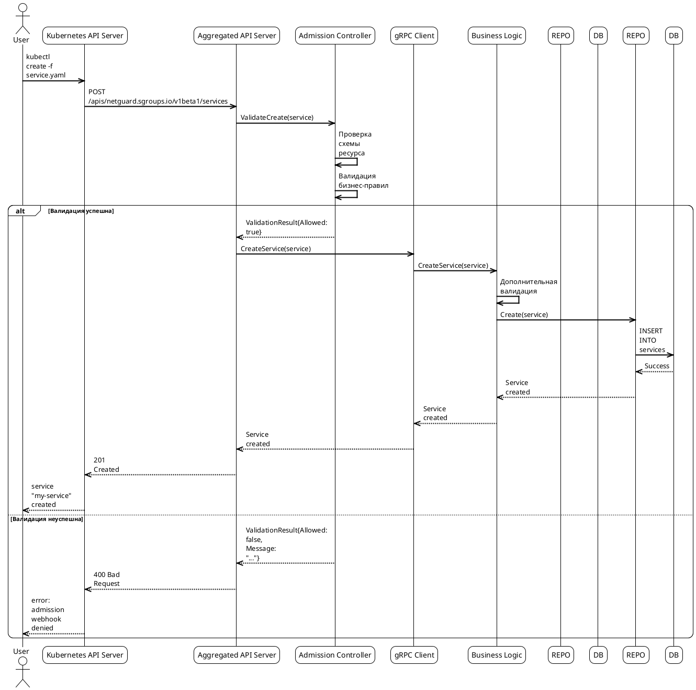

# Сценарий 1: Создание Service через Aggregated API

## Описание

Пользователь создает ресурс Service через kubectl. Запрос проходит через Kubernetes API Server к Aggregated API Server, где происходит валидация и сохранение в backend.

## Последовательность действий



## Примеры ресурсов

### 1. Успешное создание Service

#### Валидный Service ресурс

```yaml
apiVersion: netguard.sgroups.io/v1beta1
kind: Service
metadata:
  name: web-service
  namespace: default
  labels:
    app: web
    environment: production
spec:
  selfRef:
    name: web-service
    namespace: default
  ingressPorts:
    - protocol: TCP
      port: "80"
      targetPort: "8080"
    - protocol: TCP
      port: "443"
      targetPort: "8443"
  egressPorts:
    - protocol: TCP
      port: "3306"
      targetPort: "3306"
  annotations:
    description: "Web application service"
    owner: "team-web"
```

#### Результат успешного создания

```yaml
apiVersion: netguard.sgroups.io/v1beta1
kind: Service
metadata:
  name: web-service
  namespace: default
  uid: "12345678-1234-1234-1234-123456789abc"
  resourceVersion: "1"
  generation: 1
  creationTimestamp: "2024-01-15T10:30:00Z"
  labels:
    app: web
    environment: production
spec:
  selfRef:
    name: web-service
    namespace: default
  ingressPorts:
    - protocol: TCP
      port: "80"
      targetPort: "8080"
    - protocol: TCP
      port: "443"
      targetPort: "8443"
  egressPorts:
    - protocol: TCP
      port: "3306"
      targetPort: "3306"
  annotations:
    description: "Web application service"
    owner: "team-web"
status:
  conditions:
    - type: Ready
      status: "True"
      lastTransitionTime: "2024-01-15T10:30:00Z"
      reason: "Created"
      message: "Service created successfully"
```

### 2. Примеры ошибок валидации

#### Ошибка: отсутствует обязательное поле

```yaml
apiVersion: netguard.sgroups.io/v1beta1
kind: Service
metadata:
  name: invalid-service
  namespace: default
spec:
  # Отсутствует selfRef.name
  selfRef:
    namespace: default
  ingressPorts:
    - protocol: TCP
      port: "80"
```

**Ошибка валидации:**

```yaml
status:
  conditions:
    - type: Ready
      status: "False"
      lastTransitionTime: "2024-01-15T10:30:00Z"
      reason: "ValidationFailed"
      message: "spec.selfRef.name: Required value: name is required"
```

#### Ошибка: неверный номер порта

```yaml
apiVersion: netguard.sgroups.io/v1beta1
kind: Service
metadata:
  name: invalid-port-service
  namespace: default
spec:
  selfRef:
    name: invalid-port-service
    namespace: default
  ingressPorts:
    - protocol: TCP
      port: "99999"  # Неверный номер порта
```

**Ошибка валидации:**

```yaml
status:
  conditions:
    - type: Ready
      status: "False"
      lastTransitionTime: "2024-01-15T10:30:00Z"
      reason: "ValidationFailed"
      message: "spec.ingressPorts[0].port: Invalid value: 99999: port number must be between 1 and 65535"
```

### 3. Конфигурация Admission Controller

#### Настройка валидации

```yaml
apiVersion: admissionregistration.k8s.io/v1
kind: ValidatingWebhookConfiguration
metadata:
  name: netguard-validating-webhook
webhooks:
  - name: netguard.sgroups.io
    clientConfig:
      service:
        namespace: netguard-system
        name: netguard-webhook
        path: "/validate"
        port: 8443
    rules:
      - apiGroups: ["netguard.sgroups.io"]
        apiVersions: ["v1beta1"]
        operations: ["CREATE", "UPDATE"]
        resources: ["services", "addressgroups", "addressgroupbindings"]
    failurePolicy: Fail
    sideEffects: None
    admissionReviewVersions: ["v1"]
```

### 4. Конфигурация базы данных

#### Схема PostgreSQL

```sql
-- Таблица сервисов
CREATE TABLE services (
    id UUID PRIMARY KEY DEFAULT gen_random_uuid(),
    name VARCHAR(255) NOT NULL,
    namespace VARCHAR(255) NOT NULL,
    description TEXT,
    meta JSONB NOT NULL,
    created_at TIMESTAMP WITH TIME ZONE DEFAULT NOW(),
    updated_at TIMESTAMP WITH TIME ZONE DEFAULT NOW(),
    UNIQUE(name, namespace)
);

-- Таблица портов сервисов
CREATE TABLE service_ports (
    id UUID PRIMARY KEY DEFAULT gen_random_uuid(),
    service_id UUID NOT NULL REFERENCES services(id) ON DELETE CASCADE,
    protocol VARCHAR(10) NOT NULL,
    port VARCHAR(10) NOT NULL,
    target_port VARCHAR(10),
    description TEXT,
    created_at TIMESTAMP WITH TIME ZONE DEFAULT NOW()
);

-- Индексы для производительности
CREATE INDEX idx_services_namespace ON services(namespace);
CREATE INDEX idx_services_name_namespace ON services(name, namespace);
CREATE INDEX idx_service_ports_service_id ON service_ports(service_id);
```

### 5. Метрики и мониторинг

#### Prometheus метрики

```yaml
# Метрики создания сервисов
netguard_service_creation_total{namespace="default",status="success"} 1
netguard_service_creation_total{namespace="default",status="validation_failed"} 0
netguard_service_creation_duration_seconds{namespace="default",quantile="0.5"} 0.023
netguard_service_creation_duration_seconds{namespace="default",quantile="0.9"} 0.045
netguard_service_creation_duration_seconds{namespace="default",quantile="0.99"} 0.078

# Метрики валидации
netguard_validation_errors_total{resource_type="service",error_type="schema"} 0
netguard_validation_errors_total{resource_type="service",error_type="business_rule"} 0
```

#### Grafana Dashboard

```yaml
apiVersion: v1
kind: ConfigMap
metadata:
  name: netguard-service-dashboard
  namespace: monitoring
data:
  dashboard.json: |
    {
      "dashboard": {
        "title": "Netguard Service Creation",
        "panels": [
          {
            "title": "Service Creation Rate",
            "type": "graph",
            "targets": [
              {
                "expr": "rate(netguard_service_creation_total[5m])",
                "legendFormat": "{{namespace}} - {{status}}"
              }
            ]
          },
          {
            "title": "Validation Errors",
            "type": "graph",
            "targets": [
              {
                "expr": "rate(netguard_validation_errors_total[5m])",
                "legendFormat": "{{resource_type}} - {{error_type}}"
              }
            ]
          }
        ]
      }
    }
```

### 8. Типы ошибок и их обработка

#### Коды ошибок

```yaml
# Коды ошибок системы
error_codes:
  VALIDATION_ERROR: "Ошибка валидации данных"
  CONFLICT_ERROR: "Конфликт ресурсов"
  DEPENDENCY_ERROR: "Ошибка зависимостей"
  NETWORK_ERROR: "Сетевая ошибка"
  DATABASE_ERROR: "Ошибка базы данных"
  INTERNAL_ERROR: "Внутренняя ошибка системы"
  PERMISSION_ERROR: "Ошибка прав доступа"
  TIMEOUT_ERROR: "Ошибка таймаута"
```

#### Обработка ошибок в gRPC

```yaml
# Маппинг ошибок на gRPC статусы
error_mapping:
  VALIDATION_ERROR:
    grpc_code: "INVALID_ARGUMENT"
    http_status: 400
    user_message: "Validation failed"
  CONFLICT_ERROR:
    grpc_code: "ALREADY_EXISTS"
    http_status: 409
    user_message: "Resource conflict"
  DEPENDENCY_ERROR:
    grpc_code: "FAILED_PRECONDITION"
    http_status: 400
    user_message: "Dependency not met"
  NETWORK_ERROR:
    grpc_code: "UNAVAILABLE"
    http_status: 503
    user_message: "Service temporarily unavailable"
  DATABASE_ERROR:
    grpc_code: "INTERNAL"
    http_status: 500
    user_message: "Internal server error"
```

### 6. Примеры использования

#### Команды kubectl

```bash
# Создание сервиса
kubectl create -f web-service.yaml

# Проверка статуса
kubectl get service web-service -n default -o yaml

# Просмотр событий
kubectl describe service web-service -n default

# Удаление сервиса
kubectl delete service web-service -n default
```

#### Ожидаемые результаты

```bash
# Успешное создание
service.netguard.sgroups.io/web-service created

# Проверка статуса
NAME          READY   STATUS    MESSAGE
web-service   True    Ready     Service created successfully

# События
Events:
  Type    Reason   Age   From                    Message
  ----    ------   ----  ----                    -------
  Normal  Created  30s   netguard-controller     Service created successfully
  Normal  Ready    30s   netguard-controller     Service is ready
```

### 7. Логирование и отладка

#### Структура логов

```yaml
# Лог успешного создания
{
  "level": "info",
  "timestamp": "2024-01-15T10:30:00Z",
  "service_name": "web-service",
  "namespace": "default",
  "operation": "create",
  "message": "Service created successfully",
  "service_id": "12345678-1234-1234-1234-123456789abc",
  "duration_ms": 23
}

# Лог ошибки валидации
{
  "level": "error",
  "timestamp": "2024-01-15T10:30:00Z",
  "service_name": "invalid-service",
  "namespace": "default",
  "operation": "create",
  "error": "spec.selfRef.name: Required value: name is required",
  "error_type": "validation_failed"
}
```

#### Конфигурация логирования

```yaml
apiVersion: v1
kind: ConfigMap
metadata:
  name: netguard-logging-config
  namespace: netguard-system
data:
  log-level: "info"
  log-format: "json"
  log-fields: "service_name,namespace,operation"
```
