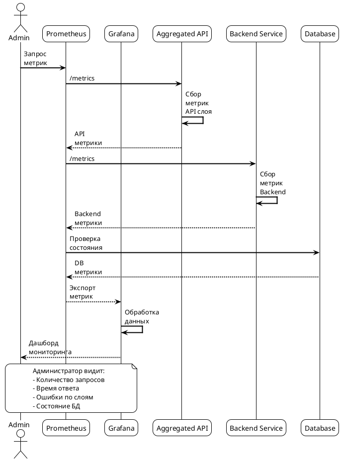
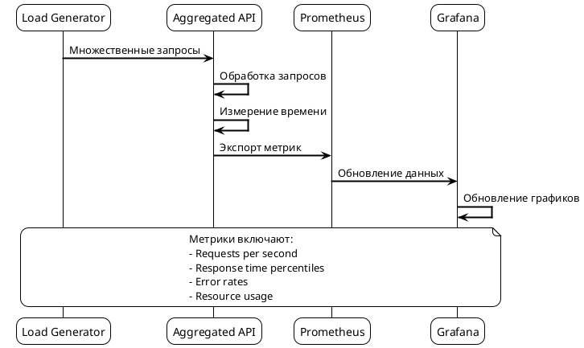
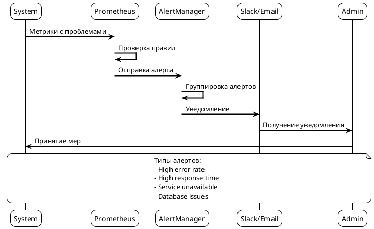

# Сценарий 5: Мониторинг и метрики системы

## Описание
Система предоставляет комплексный мониторинг и метрики для всех слоев: Aggregated API Server, Backend Service, gRPC соединения и база данных.

## Последовательность действий



## Конфигурации мониторинга

### 1. Prometheus Configuration

```yaml
# prometheus-config.yaml
apiVersion: v1
kind: ConfigMap
metadata:
  name: prometheus-netguard-config
  namespace: monitoring
data:
  prometheus.yml: |
    global:
      scrape_interval: 15s
      evaluation_interval: 15s

    rule_files:
      - "netguard-rules.yml"

    scrape_configs:
      - job_name: 'netguard-aggregated-api'
        static_configs:
          - targets: ['netguard-apiserver:8080']
        metrics_path: /metrics
        scrape_interval: 10s

      - job_name: 'netguard-backend'
        static_configs:
          - targets: ['netguard-backend:9090']
        metrics_path: /metrics
        scrape_interval: 10s

      - job_name: 'netguard-database'
        static_configs:
          - targets: ['postgres-exporter:9187']
        metrics_path: /metrics
        scrape_interval: 30s

      - job_name: 'netguard-grpc'
        static_configs:
          - targets: ['netguard-backend:9091']
        metrics_path: /metrics
        scrape_interval: 10s
```

### 2. Grafana Dashboard Configuration

```yaml
# grafana-dashboard.yaml
apiVersion: v1
kind: ConfigMap
metadata:
  name: netguard-dashboard
  namespace: monitoring
data:
  dashboard.json: |
    {
      "dashboard": {
        "title": "Netguard System Overview",
        "panels": [
          {
            "title": "API Requests per Second",
            "type": "graph",
            "targets": [
              {
                "expr": "rate(netguard_api_requests_total[5m])",
                "legendFormat": "{{method}}"
              }
            ]
          },
          {
            "title": "Response Time",
            "type": "graph",
            "targets": [
              {
                "expr": "histogram_quantile(0.95, rate(netguard_api_request_duration_seconds_bucket[5m]))",
                "legendFormat": "95th percentile"
              }
            ]
          },
          {
            "title": "Error Rate",
            "type": "graph",
            "targets": [
              {
                "expr": "rate(netguard_errors_total[5m])",
                "legendFormat": "{{error_type}}"
              }
            ]
          }
        ]
      }
    }
```

### 3. Alerting Rules

```yaml
# netguard-alerts.yaml
apiVersion: v1
kind: ConfigMap
metadata:
  name: netguard-alerts
  namespace: monitoring
data:
  netguard-rules.yml: |
    groups:
      - name: netguard.rules
        rules:
          - alert: HighErrorRate
            expr: rate(netguard_errors_total[5m]) > 0.1
            for: 2m
            labels:
              severity: warning
            annotations:
              summary: "High error rate detected"
              description: "Error rate is {{ $value }} errors per second"

          - alert: HighResponseTime
            expr: histogram_quantile(0.95, rate(netguard_api_request_duration_seconds_bucket[5m])) > 1
            for: 2m
            labels:
              severity: warning
            annotations:
              summary: "High response time detected"
              description: "95th percentile response time is {{ $value }} seconds"

          - alert: DatabaseConnectionFailed
            expr: netguard_database_connections_active == 0
            for: 1m
            labels:
              severity: critical
            annotations:
              summary: "Database connection failed"
              description: "No active database connections"

          - alert: GRPCServerDown
            expr: up{job="netguard-grpc"} == 0
            for: 1m
            labels:
              severity: critical
            annotations:
              summary: "gRPC server is down"
              description: "gRPC server is not responding"
```

## Сценарии мониторинга

### Сценарий 1: Мониторинг производительности API



### Сценарий 2: Алертинг при проблемах



## Конфигурации для разных окружений

### Development Environment

```yaml
# monitoring-dev.yaml
apiVersion: v1
kind: ConfigMap
metadata:
  name: netguard-monitoring-dev
  namespace: netguard-dev
data:
  prometheus.yml: |
    global:
      scrape_interval: 30s
    scrape_configs:
      - job_name: 'netguard-dev'
        static_configs:
          - targets: ['netguard-backend-dev:9090']
        scrape_interval: 30s

  grafana.ini: |
    [server]
    http_port = 3000
    
    [security]
    admin_user = admin
    admin_password = admin123
    
    [auth.anonymous]
    enabled = true
    org_role = Viewer
```

### Production Environment

```yaml
# monitoring-prod.yaml
apiVersion: v1
kind: ConfigMap
metadata:
  name: netguard-monitoring-prod
  namespace: netguard-prod
data:
  prometheus.yml: |
    global:
      scrape_interval: 15s
      external_labels:
        environment: production
    scrape_configs:
      - job_name: 'netguard-prod'
        static_configs:
          - targets: ['netguard-backend-prod:9090']
        scrape_interval: 15s
        metrics_path: /metrics
        scheme: https
        tls_config:
          ca_file: /etc/ssl/certs/ca.crt
          cert_file: /etc/ssl/certs/client.crt
          key_file: /etc/ssl/private/client.key

  grafana.ini: |
    [server]
    http_port = 3000
    protocol = https
    
    [security]
    admin_user = admin
    admin_password = ${GRAFANA_ADMIN_PASSWORD}
    
    [auth.ldap]
    enabled = true
    config_file = /etc/grafana/ldap.toml
```

## Дашборды и визуализация

### Основной дашборд

```yaml
# main-dashboard.yaml
apiVersion: v1
kind: ConfigMap
metadata:
  name: netguard-main-dashboard
data:
  dashboard.json: |
    {
      "dashboard": {
        "title": "Netguard System Overview",
        "refresh": "30s",
        "panels": [
          {
            "title": "System Health",
            "type": "stat",
            "targets": [
              {
                "expr": "up{job=~\"netguard.*\"}",
                "legendFormat": "{{job}}"
              }
            ]
          },
          {
            "title": "Request Rate",
            "type": "graph",
            "targets": [
              {
                "expr": "sum(rate(netguard_api_requests_total[5m])) by (method)",
                "legendFormat": "{{method}}"
              }
            ]
          },
          {
            "title": "Error Rate",
            "type": "graph",
            "targets": [
              {
                "expr": "sum(rate(netguard_errors_total[5m])) by (error_type)",
                "legendFormat": "{{error_type}}"
              }
            ]
          },
          {
            "title": "Response Time",
            "type": "graph",
            "targets": [
              {
                "expr": "histogram_quantile(0.95, rate(netguard_api_request_duration_seconds_bucket[5m]))",
                "legendFormat": "95th percentile"
              },
              {
                "expr": "histogram_quantile(0.50, rate(netguard_api_request_duration_seconds_bucket[5m]))",
                "legendFormat": "50th percentile"
              }
            ]
          }
        ]
      }
    }
```

### Специализированные дашборды

```yaml
# database-dashboard.yaml
apiVersion: v1
kind: ConfigMap
metadata:
  name: netguard-database-dashboard
data:
  dashboard.json: |
    {
      "dashboard": {
        "title": "Netguard Database",
        "panels": [
          {
            "title": "Active Connections",
            "type": "graph",
            "targets": [
              {
                "expr": "netguard_database_connections_active",
                "legendFormat": "Active connections"
              }
            ]
          },
          {
            "title": "Query Duration",
            "type": "graph",
            "targets": [
              {
                "expr": "histogram_quantile(0.95, rate(netguard_database_query_duration_seconds_bucket[5m]))",
                "legendFormat": "95th percentile"
              }
            ]
          },
          {
            "title": "Transaction Rate",
            "type": "graph",
            "targets": [
              {
                "expr": "rate(netguard_database_transactions_total[5m])",
                "legendFormat": "Transactions/sec"
              }
            ]
          }
        ]
      }
    }
```

## Метрики и их значение

### Ключевые метрики

| Метрика | Описание | Пороговые значения |
|---------|----------|-------------------|
| `netguard_api_requests_total` | Общее количество API запросов | - |
| `netguard_api_request_duration_seconds` | Время выполнения запросов | > 1s (warning), > 5s (critical) |
| `netguard_errors_total` | Количество ошибок | > 0.1/s (warning), > 1/s (critical) |
| `netguard_database_connections_active` | Активные соединения с БД | = 0 (critical) |
| `netguard_grpc_requests_total` | Количество gRPC запросов | - |
| `netguard_sync_operations_total` | Количество операций синхронизации | - |

### Health Checks

```yaml
# health-checks.yaml
apiVersion: v1
kind: ConfigMap
metadata:
  name: netguard-health-checks
data:
  health-checks.yml: |
    health_checks:
      - name: "api-server-health"
        endpoint: "/health"
        interval: "30s"
        timeout: "5s"
        expected_status: 200
        
      - name: "backend-health"
        endpoint: "/health"
        interval: "30s"
        timeout: "5s"
        expected_status: 200
        
      - name: "database-health"
        endpoint: "/health"
        interval: "60s"
        timeout: "10s"
        expected_status: 200
        
      - name: "grpc-health"
        endpoint: "/grpc.health.v1.Health/Check"
        interval: "30s"
        timeout: "5s"
        expected_response: "SERVING"
``` 