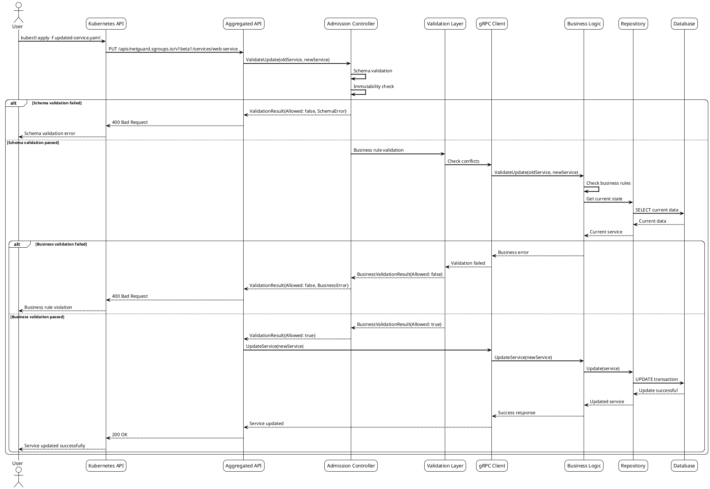
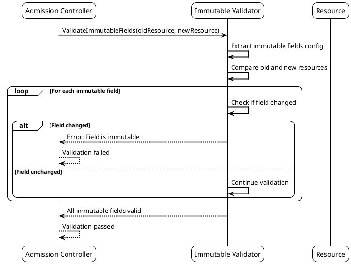
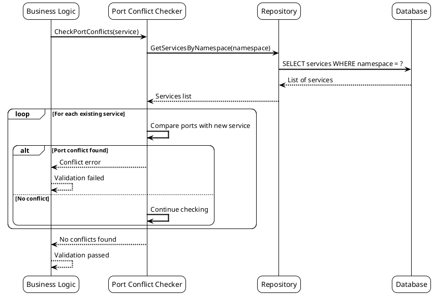

# Сценарий 6: Обновление ресурсов с валидацией

## Описание
Система выполняет обновление ресурсов с многоуровневой валидацией, проверкой неизменяемых полей и обработкой конфликтов.

## Последовательность действий



## Конфигурации валидации

### Конфигурация неизменяемых полей

```yaml
# immutable-fields-config.yaml
apiVersion: v1
kind: ConfigMap
metadata:
  name: netguard-immutable-fields
  namespace: netguard-system
data:
  immutable_fields.yaml: |
    Service:
      immutable_fields:
        - "spec.selfRef.name"
        - "spec.selfRef.namespace"
        - "metadata.uid"
        - "metadata.creationTimestamp"
    
    AddressGroup:
      immutable_fields:
        - "spec.selfRef.name"
        - "spec.selfRef.namespace"
        - "metadata.uid"
        - "metadata.creationTimestamp"
    
    AddressGroupBinding:
      immutable_fields:
        - "spec.serviceRef.identifier.name"
        - "spec.serviceRef.identifier.namespace"
        - "spec.addressGroupRef.identifier.name"
        - "spec.addressGroupRef.identifier.namespace"
        - "metadata.uid"
        - "metadata.creationTimestamp"
    
    RuleS2S:
      immutable_fields:
        - "spec.serviceLocalRef.identifier.name"
        - "spec.serviceLocalRef.identifier.namespace"
        - "spec.serviceRef.identifier.name"
        - "spec.serviceRef.identifier.namespace"
        - "metadata.uid"
        - "metadata.creationTimestamp"
```

### Конфигурация бизнес-правил валидации

```yaml
# business-rules-config.yaml
apiVersion: v1
kind: ConfigMap
metadata:
  name: netguard-business-rules
  namespace: netguard-system
data:
  business_rules.yaml: |
    Service:
      validation_rules:
        - name: "port_conflict_check"
          enabled: true
          severity: "error"
          description: "Check for port conflicts with existing services"
        
        - name: "address_group_dependency_check"
          enabled: true
          severity: "error"
          description: "Verify that referenced address groups exist"
        
        - name: "description_length_check"
          enabled: true
          severity: "warning"
          max_length: 1000
          description: "Check description field length"
    
    AddressGroup:
      validation_rules:
        - name: "network_overlap_check"
          enabled: true
          severity: "error"
          description: "Check for network CIDR overlaps"
        
        - name: "cidr_format_check"
          enabled: true
          severity: "error"
          description: "Validate CIDR format"
    
    AddressGroupBinding:
      validation_rules:
        - name: "service_existence_check"
          enabled: true
          severity: "error"
          description: "Verify that referenced service exists"
        
        - name: "address_group_existence_check"
          enabled: true
          severity: "error"
          description: "Verify that referenced address group exists"
        
        - name: "cross_namespace_policy_check"
          enabled: true
          severity: "error"
          description: "Check cross-namespace binding policies"
```

## Примеры обновления ресурсов

### Обновление Service (успешное)

```yaml
# service-update-success.yaml
apiVersion: netguard.sgroups.io/v1beta1
kind: Service
metadata:
  name: web-service
  namespace: default
  labels:
    app: web
    tier: frontend
    version: "2.0"
spec:
  description: "Updated web application service with additional ports"
  ingressPorts:
  - protocol: TCP
    port: "80"
    description: "HTTP port"
  - protocol: TCP
    port: "443"
    description: "HTTPS port"
  - protocol: TCP
    port: "8080"
    description: "Management port"
  addressGroups:
  - identifier:
      name: web-clients
      namespace: default
  - identifier:
      name: admin-clients
      namespace: default
```

**Результат**: Ресурс успешно обновлен

### Обновление Service (ошибка - неизменяемое поле)

```yaml
# service-update-immutable-error.yaml
apiVersion: netguard.sgroups.io/v1beta1
kind: Service
metadata:
  name: web-service
  namespace: default
spec:
  selfRef:
    name: renamed-service  # Попытка изменить имя
    namespace: default
  description: "Updated service"
  ingressPorts:
  - protocol: TCP
    port: "80"
```

**Результат**:
```
Error from server: admission webhook "validate.netguard.sgroups.io" denied the request: 
field "spec.selfRef.name" is immutable and cannot be changed
```

### Обновление Service (ошибка - конфликт портов)

```yaml
# service-update-port-conflict.yaml
apiVersion: netguard.sgroups.io/v1beta1
kind: Service
metadata:
  name: web-service
  namespace: default
spec:
  description: "Updated service with conflicting port"
  ingressPorts:
  - protocol: TCP
    port: "80"
  - protocol: TCP
    port: "3306"  # Конфликт с существующим MySQL сервисом
```

**Результат**:
```
Error from server: admission webhook "validate.netguard.sgroups.io" denied the request: 
port TCP/3306 conflicts with service mysql-service
```

### Обновление AddressGroup (успешное)

```yaml
# addressgroup-update-success.yaml
apiVersion: netguard.sgroups.io/v1beta1
kind: AddressGroup
metadata:
  name: web-clients
  namespace: default
  labels:
    app: web
    type: client
    updated: "true"
spec:
  description: "Updated web clients address group with additional networks"
  networks:
  - cidr: "10.0.0.0/24"
    description: "Internal network"
  - cidr: "192.168.1.0/24"
    description: "DMZ network"
  - cidr: "172.16.0.0/16"
    description: "Additional network"
  action: ACCEPT
```

## Сценарии валидации

### Сценарий 1: Проверка неизменяемых полей



### Сценарий 2: Проверка конфликтов портов



## Конфигурации для разных типов обновлений

### Обновление с проверкой зависимостей

```yaml
# dependency-check-config.yaml
apiVersion: v1
kind: ConfigMap
metadata:
  name: netguard-dependency-check
  namespace: netguard-system
data:
  dependency_checks.yaml: |
    Service:
      dependencies:
        - type: "AddressGroup"
          field: "spec.addressGroups"
          check_existence: true
          check_namespace: true
    
    AddressGroupBinding:
      dependencies:
        - type: "Service"
          field: "spec.serviceRef"
          check_existence: true
          check_namespace: true
        - type: "AddressGroup"
          field: "spec.addressGroupRef"
          check_existence: true
          check_namespace: true
    
    RuleS2S:
      dependencies:
        - type: "Service"
          field: "spec.serviceLocalRef"
          check_existence: true
          check_namespace: true
        - type: "Service"
          field: "spec.serviceRef"
          check_existence: true
          check_namespace: false  # Может быть в другом неймспейсе
```

### Конфигурация для частичных обновлений

```yaml
# partial-update-config.yaml
apiVersion: v1
kind: ConfigMap
metadata:
  name: netguard-partial-update
  namespace: netguard-system
data:
  partial_update.yaml: |
    Service:
      allowed_partial_updates:
        - "spec.description"
        - "spec.ingressPorts"
        - "spec.addressGroups"
        - "metadata.labels"
        - "metadata.annotations"
      
      required_fields_on_update:
        - "spec.selfRef"
        - "metadata.name"
        - "metadata.namespace"
    
    AddressGroup:
      allowed_partial_updates:
        - "spec.description"
        - "spec.networks"
        - "spec.action"
        - "metadata.labels"
        - "metadata.annotations"
      
      required_fields_on_update:
        - "spec.selfRef"
        - "metadata.name"
        - "metadata.namespace"
```

## Метрики обновлений

### Конфигурация метрик

```yaml
# update-metrics-config.yaml
apiVersion: v1
kind: ConfigMap
metadata:
  name: netguard-update-metrics
  namespace: netguard-system
data:
  metrics.yaml: |
    update_metrics:
      enabled: true
      buckets:
        - 0.1
        - 0.5
        - 1.0
        - 2.0
        - 5.0
      
      labels:
        - "resource_type"
        - "namespace"
        - "validation_result"
        - "error_type"
      
      counters:
        - name: "netguard_update_requests_total"
          description: "Total number of update requests"
        
        - name: "netguard_update_validation_errors_total"
          description: "Total number of validation errors during updates"
        
        - name: "netguard_update_conflicts_total"
          description: "Total number of update conflicts"
      
      histograms:
        - name: "netguard_update_duration_seconds"
          description: "Duration of update operations"
```

### Health Checks для обновлений

```yaml
# update-health-checks.yaml
apiVersion: v1
kind: ConfigMap
metadata:
  name: netguard-update-health
  namespace: netguard-system
data:
  health_checks.yaml: |
    update_health_checks:
      - name: "update_validation_health"
        endpoint: "/health/update-validation"
        interval: "30s"
        timeout: "5s"
        expected_status: 200
        
      - name: "immutable_fields_check"
        endpoint: "/health/immutable-fields"
        interval: "60s"
        timeout: "10s"
        expected_status: 200
        
      - name: "dependency_checker_health"
        endpoint: "/health/dependency-checker"
        interval: "30s"
        timeout: "5s"
        expected_status: 200
``` 