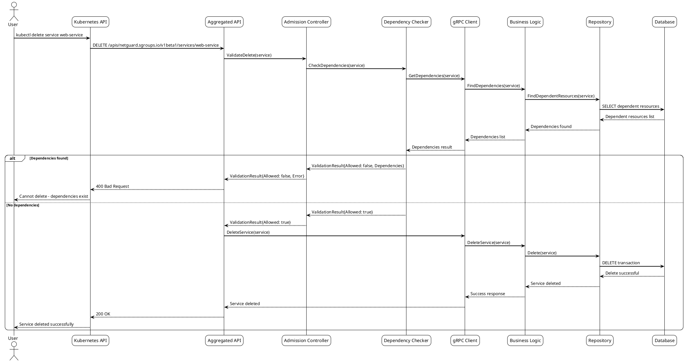
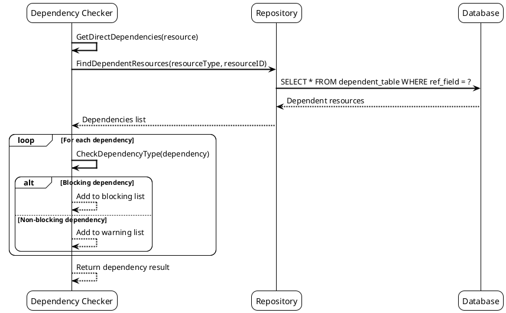
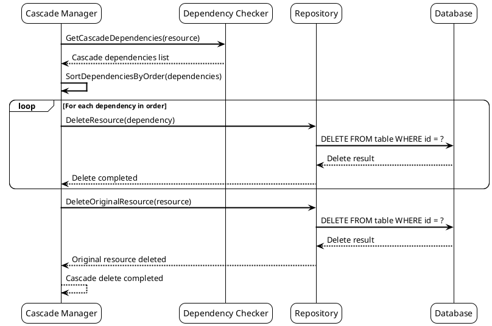

# Сценарий 7: Удаление ресурсов с проверкой зависимостей

## Описание
Система выполняет безопасное удаление ресурсов с проверкой зависимостей, предотвращая удаление ресурсов, которые используются другими компонентами.

## Последовательность действий



## Конфигурации зависимостей

### Конфигурация зависимостей ресурсов

```yaml
# dependency-config.yaml
apiVersion: v1
kind: ConfigMap
metadata:
  name: netguard-dependency-config
  namespace: netguard-system
data:
  dependencies.yaml: |
    Service:
      dependencies:
        - resource_type: "AddressGroupBinding"
          field: "spec.serviceRef.identifier"
          check_field: "selfRef"
          error_message: "Service is referenced by AddressGroupBinding"
          blocking: true
        
        - resource_type: "RuleS2S"
          field: "spec.serviceLocalRef.identifier"
          check_field: "selfRef"
          error_message: "Service is referenced as local service in RuleS2S"
          blocking: true
        
        - resource_type: "RuleS2S"
          field: "spec.serviceRef.identifier"
          check_field: "selfRef"
          error_message: "Service is referenced as remote service in RuleS2S"
          blocking: true
        
        - resource_type: "ServiceAlias"
          field: "spec.serviceRef.identifier"
          check_field: "selfRef"
          error_message: "Service has aliases"
          blocking: false  # Предупреждение, но не блокирует
    
    AddressGroup:
      dependencies:
        - resource_type: "AddressGroupBinding"
          field: "spec.addressGroupRef.identifier"
          check_field: "selfRef"
          error_message: "AddressGroup is referenced by AddressGroupBinding"
          blocking: true
        
        - resource_type: "AddressGroupBindingPolicy"
          field: "spec.addressGroupRef.identifier"
          check_field: "selfRef"
          error_message: "AddressGroup is referenced by AddressGroupBindingPolicy"
          blocking: true
        
        - resource_type: "IEAgAgRule"
          field: "spec.addressGroupRef.identifier"
          check_field: "selfRef"
          error_message: "AddressGroup is referenced by IEAgAgRule"
          blocking: true
    
    AddressGroupBinding:
      dependencies:
        - resource_type: "RuleS2S"
          field: "spec.serviceLocalRef.identifier"
          check_field: "spec.serviceRef.identifier"
          error_message: "AddressGroupBinding is referenced by RuleS2S"
          blocking: true
```

### Конфигурация каскадного удаления

```yaml
# cascade-delete-config.yaml
apiVersion: v1
kind: ConfigMap
metadata:
  name: netguard-cascade-delete
  namespace: netguard-system
data:
  cascade_delete.yaml: |
    cascade_delete_rules:
      Service:
        cascade_delete:
          - resource_type: "ServiceAlias"
            field: "spec.serviceRef.identifier"
            check_field: "selfRef"
            delete_strategy: "delete"
          
          - resource_type: "AddressGroupBinding"
            field: "spec.serviceRef.identifier"
            check_field: "selfRef"
            delete_strategy: "delete"
        
        cascade_update:
          - resource_type: "RuleS2S"
            field: "spec.serviceLocalRef.identifier"
            check_field: "selfRef"
            update_strategy: "remove_field"
      
      AddressGroup:
        cascade_delete:
          - resource_type: "AddressGroupBinding"
            field: "spec.addressGroupRef.identifier"
            check_field: "selfRef"
            delete_strategy: "delete"
          
          - resource_type: "AddressGroupBindingPolicy"
            field: "spec.addressGroupRef.identifier"
            check_field: "selfRef"
            delete_strategy: "delete"
        
        cascade_update:
          - resource_type: "Service"
            field: "spec.addressGroups"
            check_field: "selfRef"
            update_strategy: "remove_from_list"
```

## Примеры удаления ресурсов

### Удаление Service (успешное)

```yaml
# service-delete-success.yaml
apiVersion: netguard.sgroups.io/v1beta1
kind: Service
metadata:
  name: unused-service
  namespace: default
spec:
  description: "Service without dependencies"
  ingressPorts:
  - protocol: TCP
    port: "8080"
```

**Команда удаления**:
```bash
kubectl delete service unused-service -n default
```

**Результат**: `service.netguard.sgroups.io "unused-service" deleted`

### Удаление Service (ошибка - есть зависимости)

```yaml
# service-with-dependencies.yaml
apiVersion: netguard.sgroups.io/v1beta1
kind: Service
metadata:
  name: web-service
  namespace: default
spec:
  description: "Service with dependencies"
  ingressPorts:
  - protocol: TCP
    port: "80"
---
apiVersion: netguard.sgroups.io/v1beta1
kind: AddressGroupBinding
metadata:
  name: web-binding
  namespace: default
spec:
  serviceRef:
    identifier:
      name: web-service
      namespace: default
  addressGroupRef:
    identifier:
      name: web-clients
      namespace: default
```

**Команда удаления**:
```bash
kubectl delete service web-service -n default
```

**Результат**:
```
Error from server: admission webhook "validate.netguard.sgroups.io" denied the request: 
Cannot delete service 'web-service': Service is referenced by AddressGroupBinding 'web-binding'
```

### Каскадное удаление

```yaml
# cascade-delete-config.yaml
apiVersion: v1
kind: ConfigMap
metadata:
  name: netguard-cascade-delete-settings
  namespace: netguard-system
data:
  cascade_settings.yaml: |
    cascade_delete:
      enabled: true
      confirmation_required: true
      dry_run_enabled: true
      
      rules:
        - resource_type: "Service"
          cascade_delete_dependencies: true
          delete_aliases: true
          delete_bindings: true
          update_rules: true
        
        - resource_type: "AddressGroup"
          cascade_delete_dependencies: true
          delete_bindings: true
          delete_policies: true
          update_services: true
```

**Команда каскадного удаления**:
```bash
kubectl delete service web-service --cascade=true -n default
```

## Сценарии проверки зависимостей

### Сценарий 1: Проверка прямых зависимостей



### Сценарий 2: Каскадное удаление



## Конфигурации безопасности

### Конфигурация защиты критических ресурсов

```yaml
# critical-resources-protection.yaml
apiVersion: v1
kind: ConfigMap
metadata:
  name: netguard-critical-protection
  namespace: netguard-system
data:
  critical_resources.yaml: |
    critical_resources:
      - resource_type: "AddressGroup"
        name: "default-clients"
        namespace: "default"
        protection_level: "high"
        deletion_allowed: false
        reason: "Default client address group - critical for system operation"
      
      - resource_type: "Service"
        name: "api-gateway"
        namespace: "netguard-system"
        protection_level: "high"
        deletion_allowed: false
        reason: "API Gateway service - critical for system operation"
      
      - resource_type: "AddressGroup"
        name_pattern: "system-*"
        protection_level: "medium"
        deletion_allowed: true
        confirmation_required: true
        reason: "System address groups require confirmation for deletion"
```

### Конфигурация аудита удалений

```yaml
# deletion-audit-config.yaml
apiVersion: v1
kind: ConfigMap
metadata:
  name: netguard-deletion-audit
  namespace: netguard-system
data:
  audit_config.yaml: |
    deletion_audit:
      enabled: true
      log_level: "info"
      
      audit_fields:
        - "resource_type"
        - "resource_name"
        - "namespace"
        - "user"
        - "timestamp"
        - "dependencies_checked"
        - "cascade_deleted"
        - "reason"
      
      retention:
        days: 90
        max_size: "1GB"
      
      notifications:
        - type: "slack"
          channel: "#netguard-audit"
          events: ["critical_deletion", "cascade_deletion"]
        
        - type: "email"
          recipients: ["admin@company.com"]
          events: ["critical_deletion"]
```

## Метрики удалений

### Конфигурация метрик удалений

```yaml
# deletion-metrics-config.yaml
apiVersion: v1
kind: ConfigMap
metadata:
  name: netguard-deletion-metrics
  namespace: netguard-system
data:
  metrics.yaml: |
    deletion_metrics:
      enabled: true
      buckets:
        - 0.1
        - 0.5
        - 1.0
        - 2.0
        - 5.0
      
      labels:
        - "resource_type"
        - "namespace"
        - "deletion_type"
        - "cascade_deleted"
        - "dependencies_blocked"
      
      counters:
        - name: "netguard_deletion_requests_total"
          description: "Total number of deletion requests"
        
        - name: "netguard_deletion_blocked_total"
          description: "Total number of blocked deletions due to dependencies"
        
        - name: "netguard_cascade_deletions_total"
          description: "Total number of cascade deletions"
        
        - name: "netguard_critical_deletions_total"
          description: "Total number of critical resource deletions"
      
      histograms:
        - name: "netguard_deletion_duration_seconds"
          description: "Duration of deletion operations"
        
        - name: "netguard_dependency_check_duration_seconds"
          description: "Duration of dependency checks"
```

### Health Checks для удалений

```yaml
# deletion-health-checks.yaml
apiVersion: v1
kind: ConfigMap
metadata:
  name: netguard-deletion-health
  namespace: netguard-system
data:
  health_checks.yaml: |
    deletion_health_checks:
      - name: "dependency_checker_health"
        endpoint: "/health/dependency-checker"
        interval: "30s"
        timeout: "5s"
        expected_status: 200
        
      - name: "cascade_manager_health"
        endpoint: "/health/cascade-manager"
        interval: "30s"
        timeout: "5s"
        expected_status: 200
        
      - name: "audit_logger_health"
        endpoint: "/health/audit-logger"
        interval: "60s"
        timeout: "10s"
        expected_status: 200
```

## Примеры использования

### Проверка зависимостей перед удалением

```bash
# Проверка зависимостей без удаления
kubectl delete service web-service --dry-run=server -n default

# Принудительное удаление (опасно!)
kubectl delete service web-service --force --grace-period=0 -n default

# Удаление с каскадом
kubectl delete service web-service --cascade=true -n default
```

### Просмотр зависимостей

```bash
# Просмотр зависимостей сервиса
kubectl get addressgroupbindings -n default -o jsonpath='{.items[?(@.spec.serviceRef.identifier.name=="web-service")].metadata.name}'

# Просмотр всех зависимостей
kubectl get all -n default -l app=web
``` 